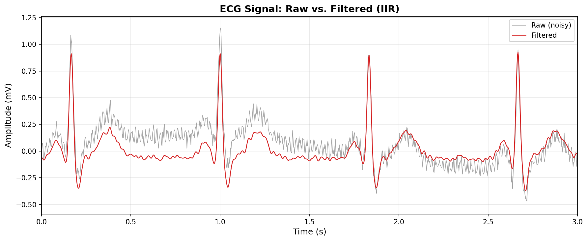
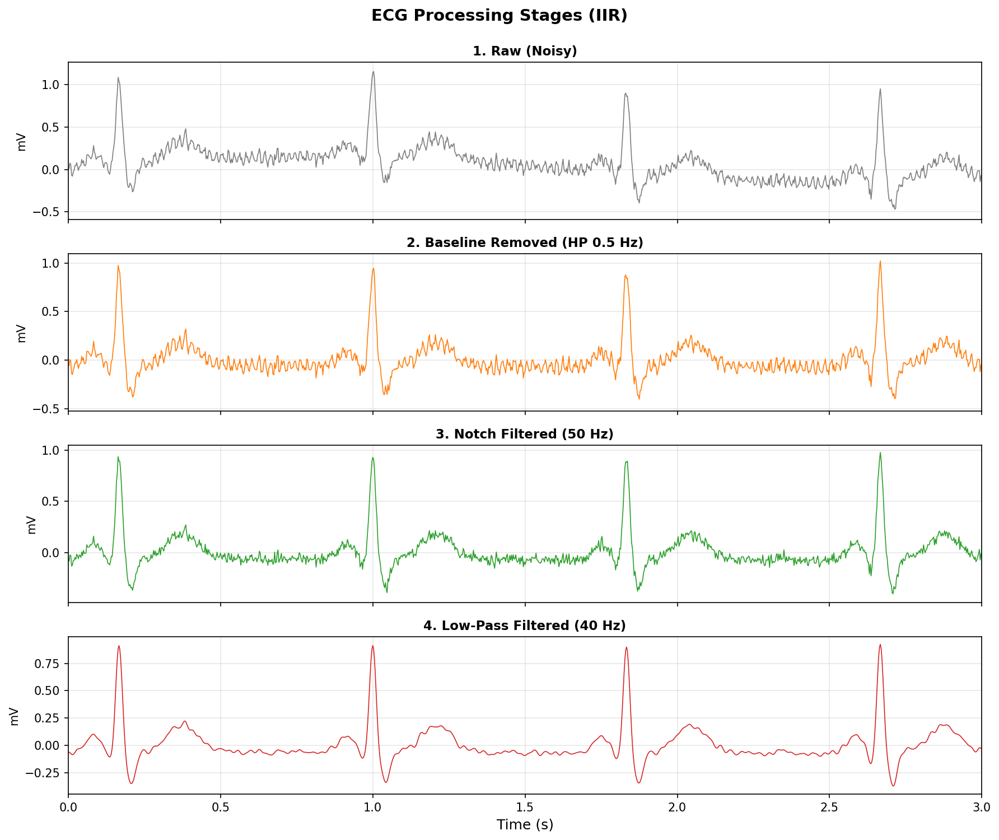
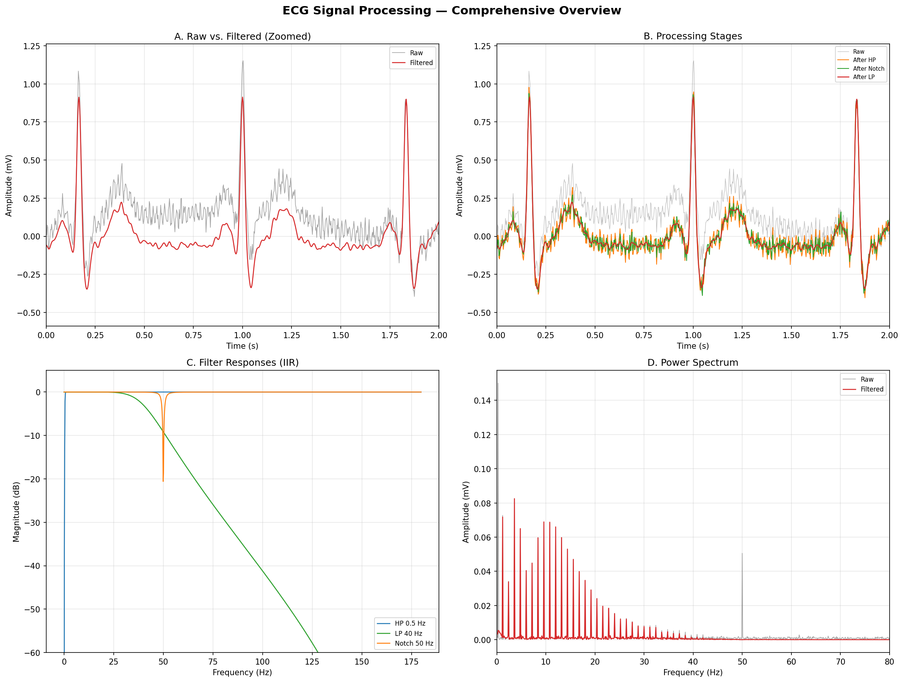

# 🫀 ECG Signal Processor

**A digital signal processing toolkit for electrocardiogram (ECG) signals.**

[](https://www.python.org/)
[](LICENSE)
[](tests/)

---

## 📋 Overview

**ECG Signal Processor** applies classical digital filter design techniques to remove common noise sources from clinical electrocardiogram recordings. It was developed as a showcase of biomedical signal processing skills for a summer internship in medical information engineering.

### Problems Addressed

Clinical ECG recordings are contaminated by three major noise sources:

| Noise Source | Cause | Frequency Range | Solution |
|---|---|---|---|
| **Baseline Wander** | Respiration, electrode motion | < 0.5 Hz | High-pass filter (0.5 Hz cut-off) |
| **Power-line Interference** | Mains electricity (50/60 Hz) | 50 or 60 Hz | Band-stop (notch) filter |
| **EMG / High-frequency Noise** | Muscle activity, electronics | > 40 Hz | Low-pass filter (40 Hz cut-off) |

### Technical Approach

- **Zero-phase filtering** via `scipy.signal.filtfilt` — forward-backward filtering eliminates phase distortion, preserving ECG waveform morphology (critical for clinical interpretation)
- **Dual filter architecture** — supports both **FIR** (window method, linear phase) and **IIR** (Butterworth, compact) designs, selectable at runtime
- **Modular pipeline** — each processing stage is independent and can be toggled on/off
- **Full test coverage** — 45 unit tests covering filter design, signal processing, data I/O, and the full pipeline

---

## 📁 Project Structure

```
ecg-processor/
├── README.md                          ← This file
├── requirements.txt                   ← Python dependencies
├── .gitignore
├── main.py                            ← CLI entry point (argparse)
├── app.py                             ← Web UI (Streamlit)
├── src/
│   ├── __init__.py                    ← Package metadata
│   ├── data_loader.py                 ← ECG data I/O + synthetic signal generator
│   ├── preprocessing.py               ← 3-stage denoising pipeline
│   ├── filters.py                     ← FIR/IIR filter design & frequency analysis
│   └── visualization.py              ← Publication-quality plotting
├── data/                              ← Sample ECG data (empty — use synthetic by default)
├── results/                           ← Generated figures (gitignored, examples kept)
│   ├── example_raw_vs_filtered.png
│   ├── example_processing_stages.png
│   └── example_comprehensive_overview.png
└── tests/
    ├── __init__.py
    ├── test_data_loader.py            ← Synthetic signal + CSV I/O tests
    ├── test_filters.py                ← FIR/IIR design & application tests
    └── test_preprocessing.py          ← Pipeline integration tests
```

---

## 🚀 Installation

### Prerequisites
- **Python 3.10** or later
- `pip` package manager

### Setup

```bash
# Clone the repository
git clone https://github.com/YOUR_USERNAME/ecg-processor.git
cd ecg-processor

# Install dependencies
pip install -r requirements.txt
```

Required packages:

| Package | Purpose |
|---|---|
| `numpy` | Numerical computing |
| `scipy` | Signal processing (`filtfilt`, `firwin`, `butter`, FFT) |
| `matplotlib` | Scientific visualisation |
| `streamlit` | Optional web-based GUI |

---

## 🔧 Usage

### Command Line Interface

```bash
# Run with defaults (synthetic signal, IIR filters, 10s)
python main.py

# Use FIR filters instead
python main.py --filter fir

# Custom heart rate and duration
python main.py --heart-rate 80 --duration 15

# Notch at 60 Hz (US mains) instead of 50 Hz
python main.py --noise-freq 60

# Save processed signal as CSV
python main.py --save-csv

# Skip specific stages
python main.py --skip-notch --skip-lowpass

# Full list of options
python main.py --help
```

### Web Application (Streamlit)

```bash
streamlit run app.py
```

This launches an interactive interface with:
- File upload or synthetic data generation
- Real-time filter parameter adjustment
- Tabbed visualisations (time domain, frequency response, spectrum)
- CSV download of processed data

---

## 🧪 Running Tests

```bash
# Run all tests
python -m pytest tests/ -v

# With coverage (requires pytest-cov)
pip install pytest-cov
python -m pytest tests/ -v --cov=src --cov-report=term
```

**Test summary:** 45 tests covering filter design, signal processing, data I/O, and the full preprocessing pipeline.

---

## 📊 Results

### 1. Raw vs. Filtered Signal (Time Domain)



*The red trace shows the filtered ECG after all three processing stages (HP + Notch + LP). The grey trace shows the original noisy signal with baseline wander, 50 Hz interference, and EMG noise.*

### 2. Processing Stages



*Step-by-step visualisation: (1) Raw noisy signal → (2) After high-pass (baseline removal) → (3) After notch (50 Hz suppression) → (4) After low-pass (final clean output).*

### 3. Comprehensive Overview



*Four-panel figure: (A) Time-domain comparison, (B) All processing stages overlaid, (C) Filter frequency responses, (D) Power spectrum before/after filtering.*

---

## 🏗️ Architecture & Design Choices

### Why `filtfilt`?

Conventional `lfilter` introduces phase shift — the R-peak of the QRS complex would be delayed relative to the original recording. In clinical diagnostics, this temporal distortion is unacceptable. `filtfilt` applies the filter forward and backward, achieving exactly zero phase shift at the cost of doubling the effective filter order.

### FIR vs. IIR

| Property | FIR | IIR (Butterworth) |
|---|---|---|
| **Phase response** | Linear (inherently) | Non-linear (corrected by `filtfilt`) |
| **Order required** | High (100+ taps) | Low (4–8) |
| **Computational cost** | Higher | Lower |
| **Stability** | Always stable | Poles must be checked |
| **Use case** | When linear phase is critical | Real-time / embedded systems |

This project implements both and lets the user choose via `--filter fir|iir`.

### Pipeline Ordering

The stages are applied in a specific order:

1. **Baseline removal first** — low-frequency drift would be distorted by subsequent filters
2. **Notch second** — narrow-band interference removal on the flattened baseline
3. **Low-pass last** — final smoothing attenuates any remaining high-frequency artifacts

---

## 🔮 Future Improvements

- [ ] **R-peak detection** — implement Pan-Tompkins or wavelet-based QRS detection
- [ ] **Real-time streaming** — replace `filtfilt` with adaptive filtering for live ECG monitoring
- [ ] **Additional filter types** — Chebyshev, elliptic, or wavelet-based denoising
- [ ] **Real dataset benchmark** — evaluate on MIT-BIH Arrhythmia Database with SNR metrics
- [ ] **Export to EDF format** — support European Data Format for clinical interoperability
- [ ] **Docker deployment** — containerised Streamlit app for easy sharing
- [ ] **CI/CD pipeline** — GitHub Actions for automated testing and linting

---

## 📄 License

This project is licensed under the MIT License. See [LICENSE](LICENSE) for details.

---

## 🙋 Acknowledgements

- **PhysioNet** — for the MIT-BIH Arrhythmia Database and WFDB format specification
- **SciPy** — for the excellent `signal` module used throughout this project
- **Streamlit** — for enabling rapid development of the interactive web interface

---

*Built with ❤️ as a summer internship project.*
